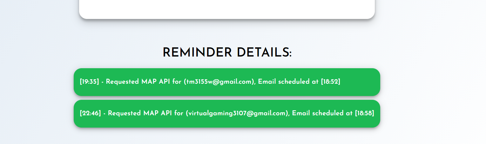

# Conwo Assignment

## Objective
- Design an application to remind the traveler when he/she has to leave in order to reach the destination on time.

## Requirements:
- Standard form submission with 4 fields source lat/long, destination lat/long, email, and time.
- The app needs to find the exact time a user needs to leave to be at that destination at that time.
- Schedule an email for the time user needs to leave.

## Tech Stack
- Backend: Nodejs
- Frontend: React 

## Installation & Testing
- Download the repo.
- Install the server packages with,

```sh
 npm install
```
- Install client packages with,

```sh
 cd client && npm install
 cd..
```
- Start server

```sh
 npm run dev
```
- .env structure

```sh
EMAIL="TEST_EMAIL"
PASSWORD="TEST_PASSWORD"
```


## Screenshots
- Home 


- Form Validation


- Destination is not Reachable


- Input-1


- Input-2


- Email-1


- Email-2


## License
[MIT](https://choosealicense.com/licenses/mit/)
